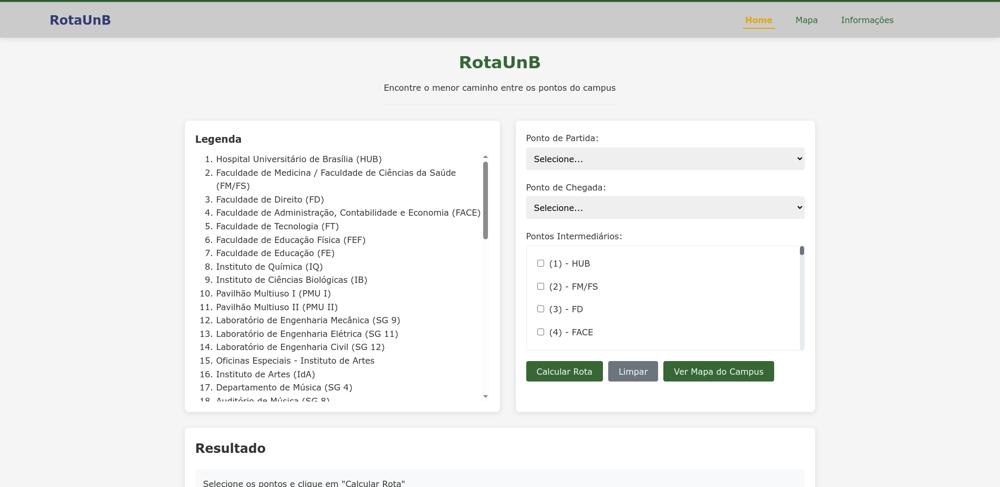
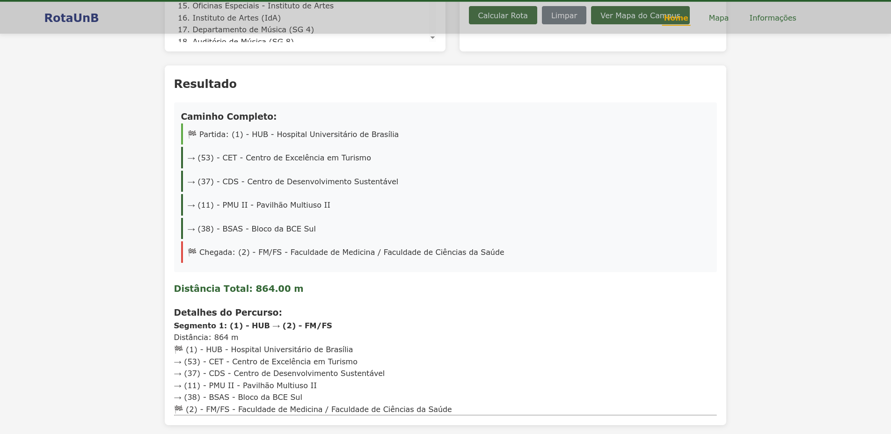
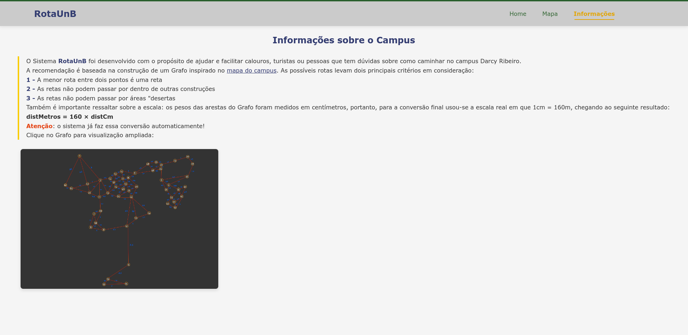
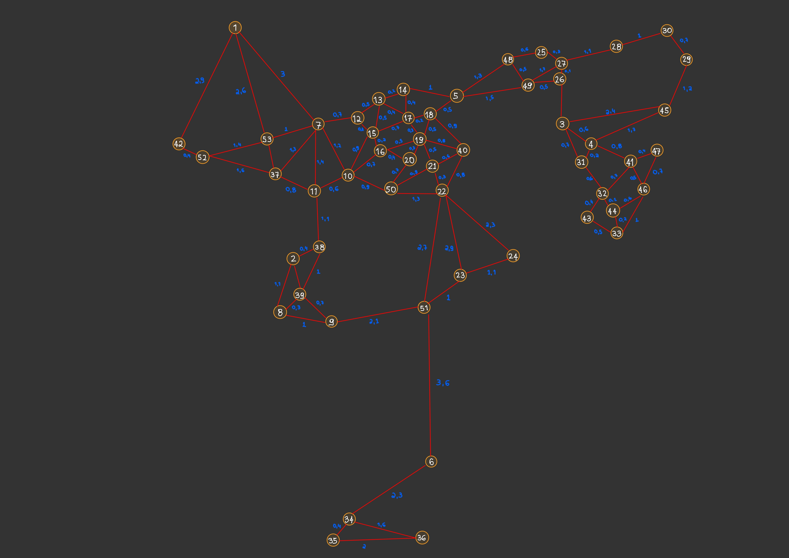

# RotaUnB

**Conteúdo da Disciplina**: Grafos 2 

## Alunos
|Matrícula | Aluno |
| -- | -- |
| 22/2031045  |  Caio Magalhães Lamego |
| 22/2037737 |  Matheus de Siqueira Brant |

## Sobre 
O Sistema RotaUnB foi desenvolvido com o propósito de ajudar e facilitar calouros, turistas ou pessoas que tem dúvidas sobre como caminhar no campus Darcy Ribeiro. Com isso, o RotaUnB calcula a menor rota para sua visitação!

A recomendação é baseada na construção de um Grafo inspirado no mapa do campus. As possíveis rotas levam dois principais critérios em consideração:

1 - A menor rota entre dois pontos é uma reta

2 - As retas não podem passar por dentro de outras construções

3 - As retas não podem passar por áreas "desertas

Também é importante ressaltar sobre a escala: os pesos das arestas do Grafo foram medidos em centímetros, portanto, para a conversão final usou-se a escala real em que 1cm = 160m, chegando ao seguinte resultado:

distMetros = 160 × distCm

Atenção: o sistema já faz essa conversão automaticamente!

## Screenshots
**Home**

**Resultado**

**Informações**

**Grafo**

**Mapa**

## Instalação 
**Linguagem**: Python, Javascript,HTML, CSS  
**Pré-Requisitos**: Ter Python instalado na máquina e rodar o requirements.txt 
**Passo a Passo:**: Rodar no terminal:
**1** - Rodar o LiveServer do arquivo index.html
**2** - pip install -r requirements.txt
**3** - python3 backend/server.py

## Uso 
Primeiramente o usuário deve selecionar o ponto de partida e o ponto de chegada. Após isso, selecione quais pontos intermediários você deseja visitar. Por fim, basta clicar em "Calcular Rota" e visualizar no campo "Resultado" qual a menor rota para sua visitação no campus da UnB Darcy Ribeiro!
Não sabe o que significa a Sigla? Basta visitar a aba "Legenda" na Home!
Está em dúvida sobre o Mapa? Clique em "Mapa" na barra de navegação ou em "Ver Mapa do Campus" na Home!
Caso tenha alguma dúvida sobre o sistema, basta acessar a aba Informações na barra de navegação!

## Outros 
Link do Repositório: https://github.com/projeto-de-algoritmos-2025/Grafos2_RotaUnb
Link do Vídeo de Apresentação: preencher
Link do mapa do campus Darcy Ribeiro (UnB): https://noticias.unb.br/images/mapas_campi_unb.pdf

